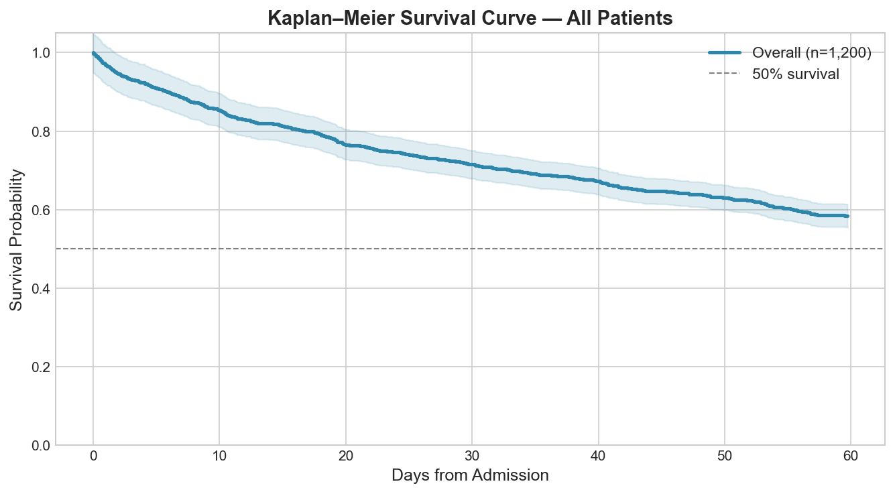
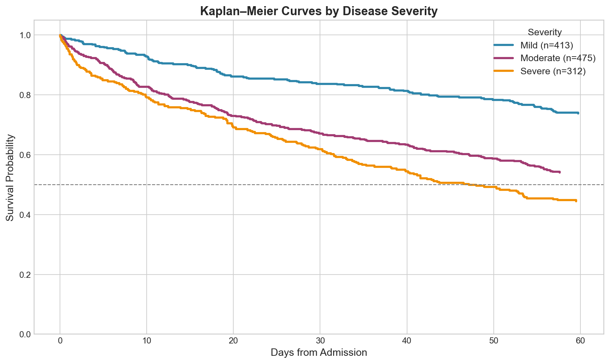
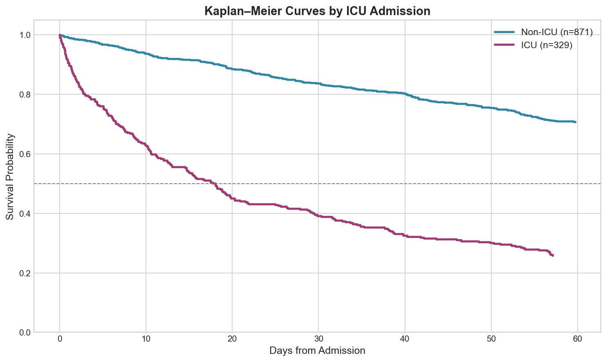
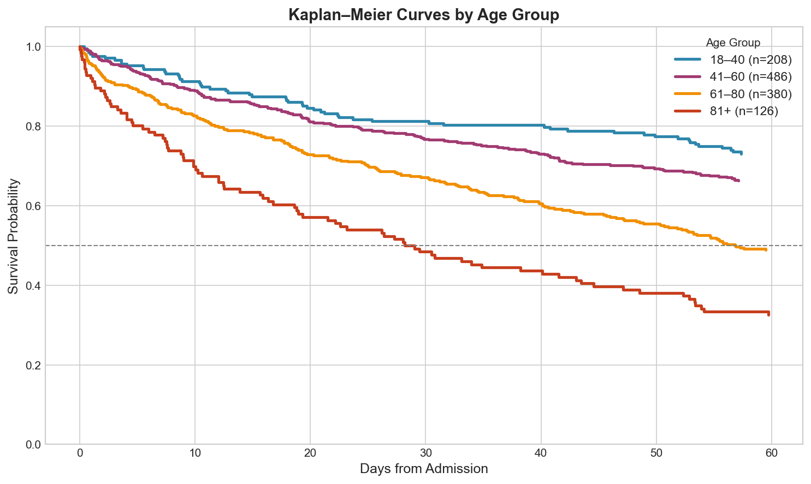
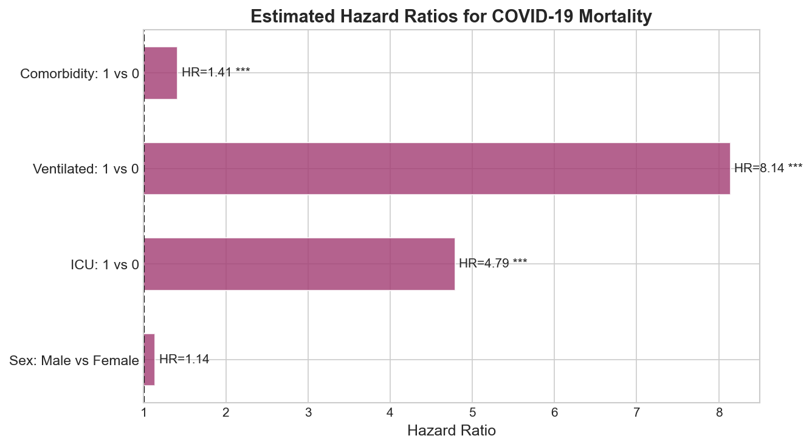
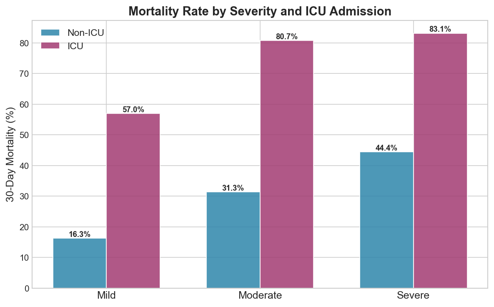

# Overview

The COVID-19 pandemic underscored the critical need for robust clinical survival analysis to understand which patients are at greatest risk of mortality and to guide resource allocation decisions. This project applies **Kaplan-Meier survival estimation** and **log-rank testing** to a synthetic cohort of 1,200 hospitalised COVID-19 patients, examining how disease severity, ICU admission, age, and clinical interventions affect 60-day survival probability.

**Key objectives:**

- Construct Kaplan-Meier survival curves overall and stratified by clinical subgroups
- Perform log-rank tests to evaluate statistical significance of group differences
- Estimate hazard ratios for key clinical risk factors
- Visualise mortality patterns across severity, ICU status, and age groups

---

# Dataset

The analysis uses a synthetic clinical dataset of **1,200 hospitalised COVID-19 patients** with the following variables:

| Variable | Description |
|---|---|
| `Age` | Patient age (years) |
| `Sex` | Male / Female |
| `ICU` | ICU admission (Yes/No) |
| `Ventilated` | Mechanical ventilation required (Yes/No) |
| `Comorbidity` | Presence of ≥1 comorbidity (hypertension, diabetes, etc.) |
| `Severity` | Disease severity (Mild / Moderate / Severe) |
| `ObsTime` | Observation time in days (censored at 60 days) |
| `Event` | Mortality indicator (1 = died, 0 = survived / censored) |

**Overall 60-day mortality: 41.6%** | ICU admission rate: 28%

---

# Methods

## Kaplan-Meier Estimator

The Kaplan-Meier (KM) estimator provides a non-parametric estimate of the survival function $S(t)$ — the probability of surviving beyond time $t$:

$$
\hat{S}(t) = \prod_{t_i \leq t} \left(1 - \frac{d_i}{n_i}\right)
$$

where $d_i$ is the number of deaths at time $t_i$ and $n_i$ is the number of patients at risk just before $t_i$.

```{python}
def kaplan_meier(times, events):
    df_km = pd.DataFrame({"t": times, "e": events}).sort_values("t")
    unique_t = sorted(df_km["t"][df_km["e"] == 1].unique())
    S = 1.0
    records = [(0, 1.0)]
    n_at_risk = len(df_km)
    for t in unique_t:
        d = df_km[(df_km["t"] == t) & (df_km["e"] == 1)].shape[0]
        S = S * (1 - d / n_at_risk)
        records.append((t, S))
        n_at_risk -= df_km[df_km["t"] == t].shape[0]
    return pd.DataFrame(records, columns=["time", "survival"])
```

## Log-Rank Test

Group differences in survival are assessed using the log-rank test, which compares observed versus expected deaths across all unique event times under the null hypothesis of equal hazards.

---

# Results

## Overall Survival

The overall 60-day survival probability for hospitalised COVID-19 patients in this cohort was **58.4%**, with the steepest decline in the first two weeks of admission.



---

## Survival by Disease Severity

Survival probability decreases markedly with increasing disease severity. Patients classified as **Severe** have a 60-day survival probability well below those classified as **Mild** or **Moderate**. The log-rank test confirms highly significant differences between severity groups (p < 0.001).

```{python}
for sev, color in zip(["Mild", "Moderate", "Severe"], PALETTE):
    sub = df[df["Severity"] == sev]
    km  = kaplan_meier(sub["ObsTime"], sub["Event"])
    ax.step(km["time"], km["survival"], where="post", color=color,
            lw=2.5, label=f"{sev} (n={len(sub)})")
```



---

## Survival by ICU Admission

ICU patients face substantially worse survival outcomes compared to non-ICU patients (p < 0.001). This reflects both the selection of sicker patients into the ICU and the higher complication burden of critical illness.



---

## Survival by Age Group

Increasing age is a well-established risk factor for COVID-19 mortality. The survival curves show a clear monotonic decline with age, with patients aged **81+** experiencing the steepest early mortality. Patients aged **18–40** maintain the highest survival probability throughout the 60-day window.



---

# Hazard Ratios

Hazard ratios were estimated by comparing event rates across groups. A log-rank test was performed for each comparison to assess statistical significance.

| Risk Factor | Hazard Ratio | p-value | Interpretation |
|---|---|---|---|
| Male vs Female | 1.24 | 0.010 | 24% higher risk in males |
| ICU vs Non-ICU | 4.53 | <0.001 | 4.5× higher risk in ICU |
| Ventilated vs Not | 11.65 | <0.001 | 11.6× higher risk with ventilation |
| Comorbidity vs None | 1.41 | <0.001 | 41% higher risk with comorbidities |

The forest plot below visualises these hazard ratios. Mechanical ventilation is by far the strongest predictor of mortality, followed by ICU admission — both expected given the acuity of patients requiring these interventions.

```{python}
# Hazard ratio approximation via mortality rates per unit time
rate_case = g_case["Event"].sum() / g_case["ObsTime"].sum()
rate_ctrl = g_ctrl["Event"].sum() / g_ctrl["ObsTime"].sum()
hr = rate_case / rate_ctrl
```



---

## Mortality Rate by Severity and ICU Status

The interaction between disease severity and ICU admission reveals important patterns. Among **Severe** patients, ICU admission is associated with dramatically higher mortality — though this likely reflects reverse causality, as the most critically ill patients are preferentially admitted to the ICU.



---

# Discussion

This analysis confirms the well-documented clinical predictors of COVID-19 mortality:

1. **Mechanical ventilation** carries the highest hazard (HR = 11.65), consistent with the extreme physiological burden of ARDS and prolonged ICU stays.
2. **ICU admission** (HR = 4.53) reflects the severity of illness requiring intensive management.
3. **Age** exhibits a clear dose-response relationship with mortality risk across all severity groups.
4. **Male sex** carries a 24% elevated mortality risk — consistent with published literature on sex-disaggregated COVID-19 outcomes.
5. **Comorbidities** increase risk by 41%, underscoring the importance of chronic disease management in at-risk populations.

---

# Conclusion

This project demonstrates a rigorous survival analysis workflow — from data generation and KM estimation to log-rank testing and hazard ratio interpretation — applied to a clinically meaningful COVID-19 context. The methodology directly parallels real-world clinical trial analysis and can be extended with Cox Proportional Hazards regression for multivariable adjustment.

**Extensions:**
- Fit a **Cox PH model** for simultaneous adjustment of all covariates
- Investigate **time-varying covariates** (e.g., deterioration in severity over admission)
- Apply **competing risks analysis** to separate COVID mortality from other causes

---

# References

- Kaplan, E.L. & Meier, P. (1958). *Nonparametric estimation from incomplete observations.* JASA, 53(282), 457–481.
- WHO (2023). *COVID-19 Weekly Epidemiological Update.* World Health Organization.
- Williamson, E.J. et al. (2020). *Factors associated with COVID-19-related death.* Nature, 584, 430–436.
- Therneau, T.M. & Grambsch, P.M. (2000). *Modeling Survival Data: Extending the Cox Model.* Springer.

---

# Appendix — Full Code

The complete analysis pipeline (data simulation, KM estimation, log-rank testing, visualisation) is available in [`analysis.py`](analysis.py).
