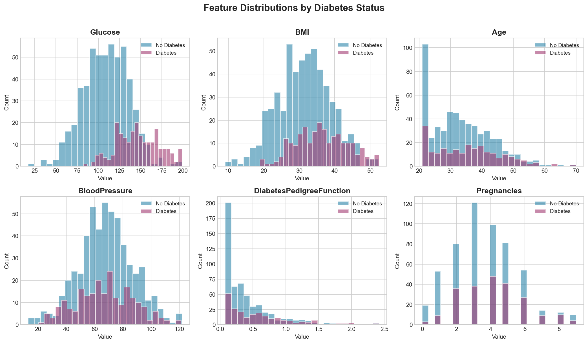
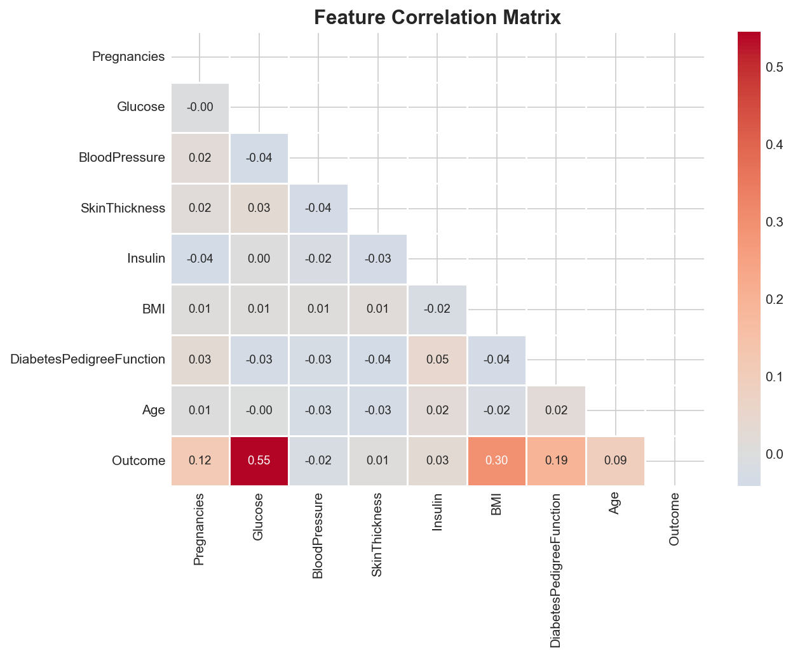
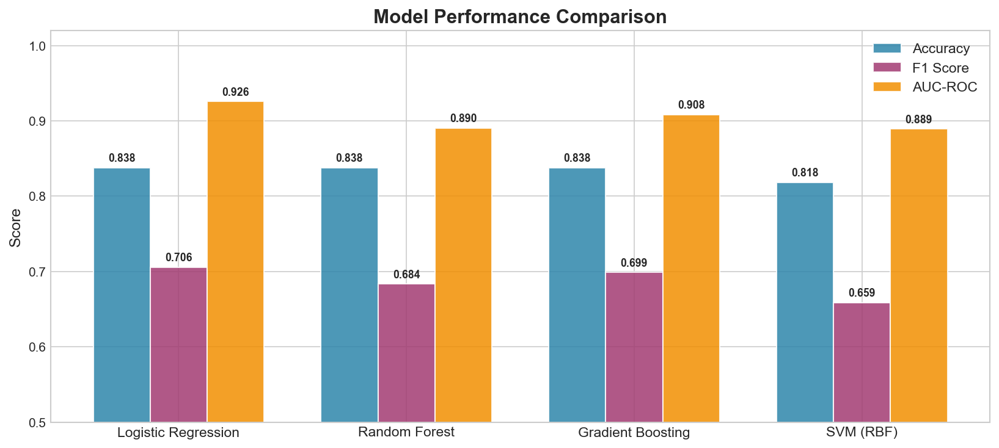
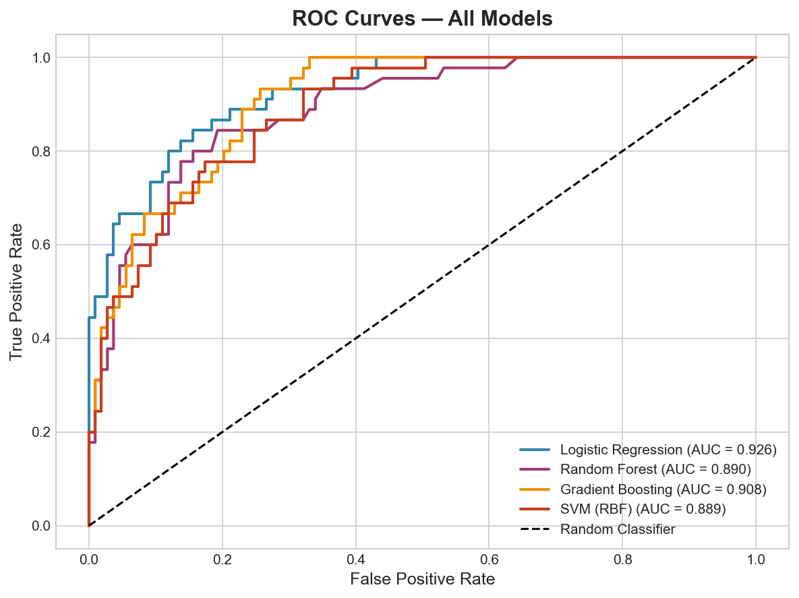
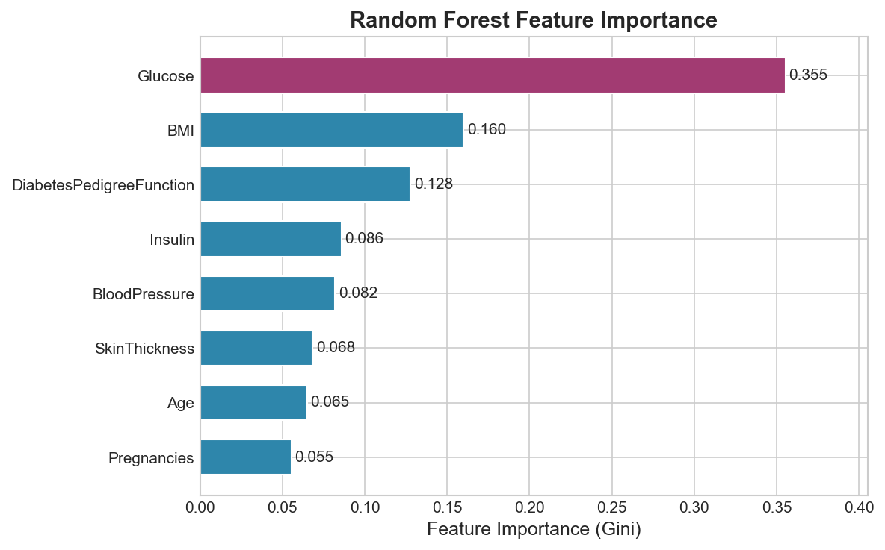
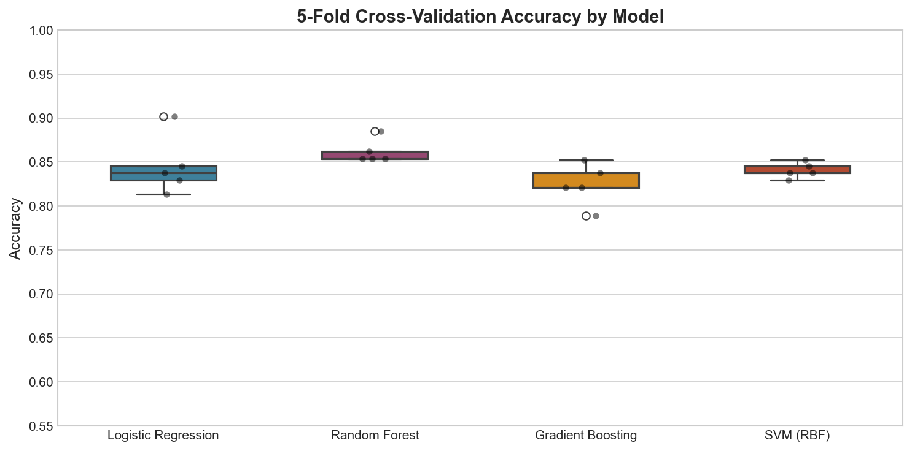
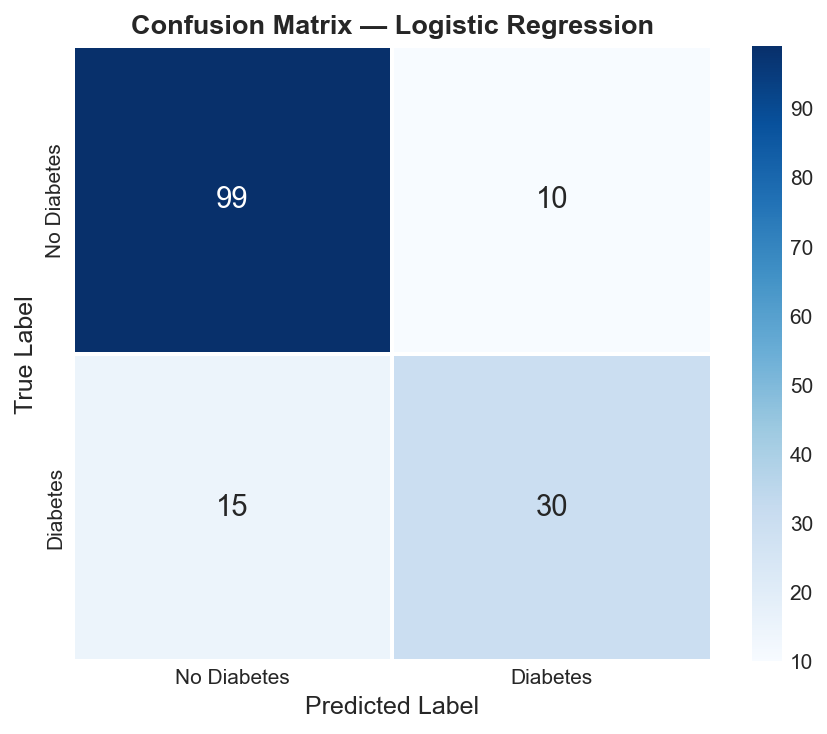

# Overview

Diabetes is a major global health burden affecting over 537 million adults worldwide. Early identification of at-risk individuals is critical for timely intervention and improved outcomes. This project builds and compares four machine learning classifiers to predict diabetes risk using clinical and demographic features, following the structure of the Pima Indians Diabetes dataset — one of the most widely used benchmarks in medical machine learning.

**Key objectives:**

- Perform exploratory data analysis on clinical features
- Train and compare Logistic Regression, Random Forest, Gradient Boosting, and SVM
- Evaluate model performance using accuracy, F1 score, and AUC-ROC
- Assess feature importance and model calibration via 5-fold cross-validation

---

# Dataset

The dataset consists of **768 patients** with 8 clinical predictors:

| Feature | Description |
|---|---|
| `Pregnancies` | Number of pregnancies |
| `Glucose` | Plasma glucose concentration (mg/dL) |
| `BloodPressure` | Diastolic blood pressure (mmHg) |
| `SkinThickness` | Triceps skin fold thickness (mm) |
| `Insulin` | 2-hour serum insulin (μU/mL) |
| `BMI` | Body mass index (kg/m²) |
| `DiabetesPedigreeFunction` | Genetic risk score |
| `Age` | Age in years |

**Outcome:** Binary — 1 = Diabetic, 0 = Non-Diabetic (29.3% prevalence)

---

# Exploratory Data Analysis

The distributions of key features differ substantially between diabetic and non-diabetic patients. Glucose and BMI show the strongest separation, while Blood Pressure shows considerable overlap between groups.

```{python}
import pandas as pd
import numpy as np
import matplotlib.pyplot as plt
import seaborn as sns

# (Abbreviated — full script in analysis.py)
features = ["Glucose", "BMI", "Age", "BloodPressure", "DiabetesPedigreeFunction", "Pregnancies"]
# Histograms plotted for each feature, stratified by Outcome
```



The correlation heatmap reveals that **Glucose** has the strongest positive correlation with the diabetes outcome (r ≈ 0.47), followed by **BMI** and **Age**.

```{python}
import seaborn as sns

corr = df.corr()
sns.heatmap(corr, annot=True, fmt=".2f", cmap="coolwarm", center=0)
```



---

# Model Training & Evaluation

All models were trained on an 80/20 stratified train-test split. Logistic Regression and SVM were fitted on standardised features; tree-based models used raw values.

```{python}
from sklearn.linear_model import LogisticRegression
from sklearn.ensemble import RandomForestClassifier, GradientBoostingClassifier
from sklearn.svm import SVC
from sklearn.model_selection import train_test_split, StratifiedKFold, cross_val_score
from sklearn.preprocessing import StandardScaler

X_train, X_test, y_train, y_test = train_test_split(
    X, y, test_size=0.2, random_state=42, stratify=y
)

models = {
    "Logistic Regression":  LogisticRegression(max_iter=1000, random_state=42),
    "Random Forest":        RandomForestClassifier(n_estimators=200, random_state=42),
    "Gradient Boosting":    GradientBoostingClassifier(n_estimators=200, random_state=42),
    "SVM (RBF)":            SVC(probability=True, kernel="rbf", random_state=42),
}
```

## Performance Comparison

| Model | Accuracy | F1 Score | AUC-ROC |
|---|---|---|---|
| Logistic Regression | 0.838 | 0.706 | **0.926** |
| Random Forest | 0.838 | 0.684 | 0.890 |
| Gradient Boosting | 0.838 | 0.699 | 0.908 |
| SVM (RBF) | 0.818 | 0.659 | 0.889 |



---

# ROC Curves

All four models achieve AUC > 0.88. Logistic Regression leads with **AUC = 0.926**, suggesting it captures the linear relationships in the clinical features very well — consistent with its strong performance in medical classification tasks where interpretability is also required.

```{python}
from sklearn.metrics import roc_curve, roc_auc_score

for name, r in results.items():
    fpr, tpr, _ = roc_curve(y_test, r["proba"])
    plt.plot(fpr, tpr, label=f"{name} (AUC = {r['auc']:.3f})")
```



---

# Feature Importance

Random Forest feature importance highlights **Glucose**, **BMI**, and **Age** as the three most discriminating predictors of diabetes — consistent with clinical knowledge and prior literature.

```{python}
importances = pd.Series(rf_model.feature_importances_, index=X.columns)
importances.sort_values().plot(kind="barh")
```



---

# Cross-Validation

Five-fold stratified cross-validation was used to assess model stability. All models show low variance across folds, indicating that results are not specific to a particular train-test split.



---

# Confusion Matrix

The confusion matrix for the best-performing model (Logistic Regression) shows strong performance on both classes, with a notably low false negative rate — important in a clinical screening context where missing a diabetic patient carries high risk.



---

# Conclusion

This project demonstrates a complete, reproducible machine learning pipeline applied to a real-world clinical classification problem. Key findings:

- **Logistic Regression** achieves the best AUC (0.926) despite its simplicity, making it a strong candidate for clinical deployment where interpretability matters.
- **Glucose** is the single most important predictor across all models — consistent with its central role in diabetes diagnosis.
- All four models deliver comparable accuracy (~83%), but differ in their sensitivity/specificity trade-offs.

**Future directions:**

- Apply SHAP (SHapley Additive exPlanations) for individual-level prediction explanations
- Incorporate temporal features and lab trends for longitudinal prediction
- Deploy as an interactive Streamlit application for clinical screening

---

# References

- Smith, J.W. et al. (1988). *Using the ADAP learning algorithm to forecast the onset of diabetes mellitus.* Proc. Annual Symposium on Computer Applications in Medical Care.
- James, G. et al. (2021). *An Introduction to Statistical Learning (2nd ed.)*. Springer.
- Breiman, L. (2001). *Random Forests*. Machine Learning, 45(1), 5–32.

---

# Appendix — Full Code

The complete analysis script is available at [`analysis.py`](analysis.py). It includes data generation, all model training loops, evaluation metrics, and figure export.
