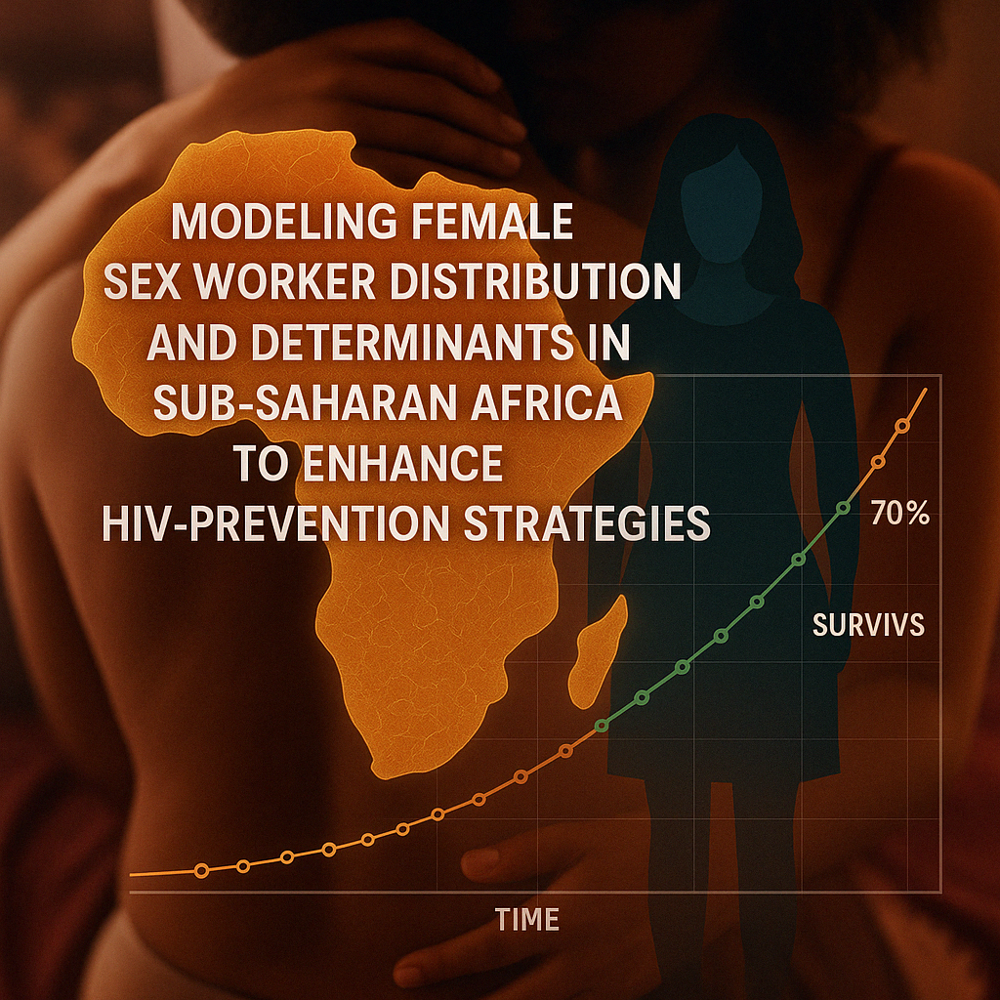

# Modeling Female Sex Worker Distribution in Sub-Saharan Africa

## Introduction

Sex workers represent a critical population for targeted HIV prevention strategies. This project models the geographic and structural determinants of female sex worker (FSW) distribution across Sub-Saharan Africa using Generalized Linear Models (GLMs).

📄 **Read the full report**:\
➡️ [GLM Final Project (PDF)](https://raw.githubusercontent.com/Fowotadeseun/Portfolio/main/Content/Projects/Female%20Sex%20Worker/GLM_Final_Project.pdf)

------------------------------------------------------------------------

## Project Objectives

📊 Identify predictors of high FSW density using statistical modeling.

🌍 Understand regional disparities and implications for HIV transmission.

🔬 Inform strategic interventions and resource allocation using evidence-based methods.

------------------------------------------------------------------------

## Key Results

-   Urbanization, migration, and economic indicators are strong predictors of FSW distribution.
-   GLMs helped reveal structural drivers behind observed geographic clustering.
-   The model supports regional targeting for HIV-prevention programs.

------------------------------------------------------------------------

## Implications

-   This study provides a statistical framework to guide health intervention planning across SSA.
-   Findings can assist NGOs, governments, and policymakers in focusing resources.

------------------------------------------------------------------------

## Learn More

🔗 [GitHub Repo](https://github.com/Fowotadeseun/Portfolio)\
📩 [Connect on LinkedIn](https://www.linkedin.com/in/oluwaseunfowotade/)
