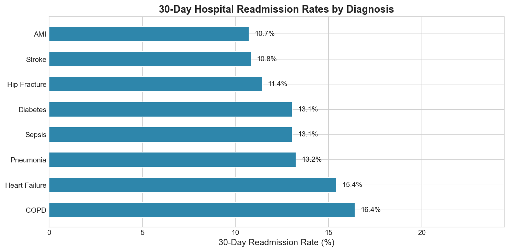
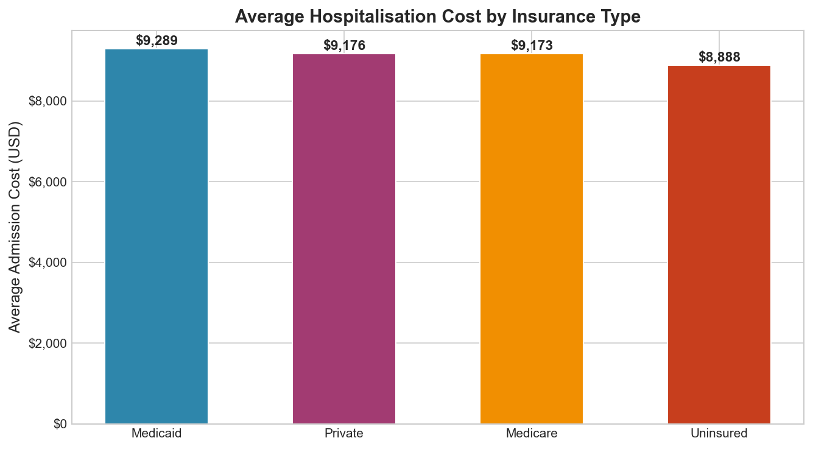
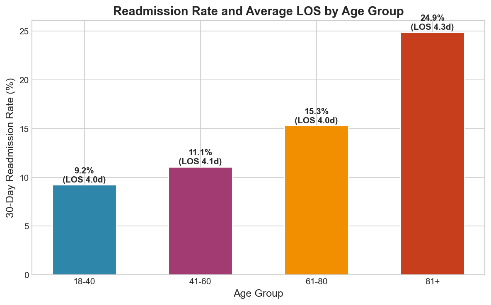
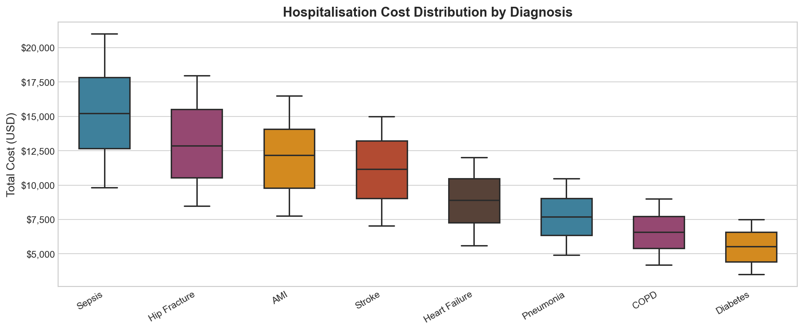
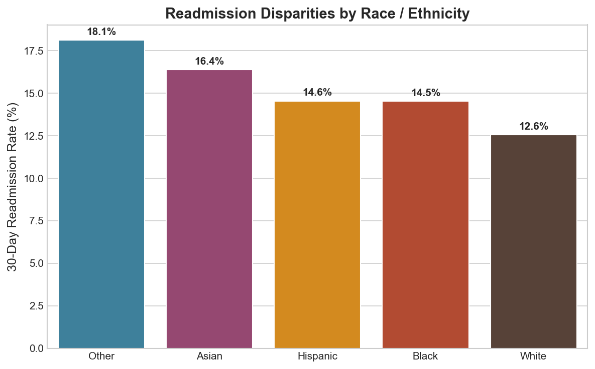
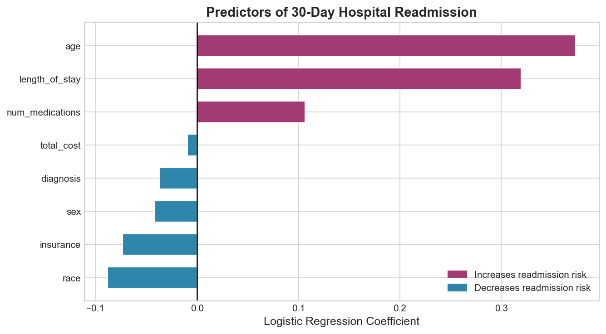

# Overview

Hospital readmissions within 30 days represent a major quality and cost challenge for healthcare systems worldwide. In the United States alone, unplanned readmissions cost Medicare over **\$26 billion annually**. Understanding which patient populations and diagnoses drive readmission is essential for designing targeted intervention programmes.

This project builds a **complete data analytics pipeline** — from database construction to predictive modelling — using **SQLite** for structured querying and **Python** for statistical analysis and visualisation.

**Key objectives:**

- Design and populate a relational SQLite database of hospital admissions
- Write SQL queries to extract readmission rates, cost metrics, and demographic patterns
- Visualise disparities across diagnoses, insurance types, age groups, and race/ethnicity
- Fit a logistic regression model to identify clinical predictors of readmission

---

# Database Design

The pipeline uses two relational tables: **patients** (demographics) and **admissions** (clinical episode data), joined on `patient_id`.

```{python}
import sqlite3
import pandas as pd

conn = sqlite3.connect(":memory:")
cur  = conn.cursor()

cur.execute("""
    CREATE TABLE patients (
        patient_id   INTEGER PRIMARY KEY,
        age          INTEGER,
        sex          TEXT,
        race         TEXT,
        insurance    TEXT
    )
""")

cur.execute("""
    CREATE TABLE admissions (
        admission_id    INTEGER PRIMARY KEY,
        patient_id      INTEGER,
        diagnosis       TEXT,
        length_of_stay  INTEGER,
        total_cost      REAL,
        num_medications INTEGER,
        readmitted_30d  INTEGER,
        FOREIGN KEY (patient_id) REFERENCES patients(patient_id)
    )
""")
```

The dataset covers **5,000 patient admissions** across 8 diagnosis categories, 4 insurance types, and 5 race/ethnicity groups. The 30-day readmission rate is **~13.5%** — consistent with national benchmarks.

---

# SQL Queries

## Q1 — Readmission Rate by Diagnosis

```{sql}
SELECT
    a.diagnosis,
    COUNT(*)                         AS total_cases,
    ROUND(AVG(a.total_cost), 2)      AS avg_cost,
    ROUND(AVG(a.length_of_stay), 2)  AS avg_los,
    ROUND(100.0 * SUM(a.readmitted_30d) / COUNT(*), 2) AS readmit_rate_pct
FROM admissions a
GROUP BY a.diagnosis
ORDER BY readmit_rate_pct DESC
```

## Q2 — Cost and Readmission by Insurance Type

```{sql}
SELECT
    p.insurance,
    COUNT(*)                        AS patients,
    ROUND(AVG(a.total_cost), 2)     AS avg_cost,
    ROUND(100.0 * SUM(a.readmitted_30d) / COUNT(*), 2) AS readmit_rate_pct
FROM patients p
JOIN admissions a ON p.patient_id = a.patient_id
GROUP BY p.insurance
ORDER BY avg_cost DESC
```

## Q3 — Readmission and LOS by Age Group

```{sql}
SELECT
    CASE
        WHEN p.age BETWEEN 18 AND 40 THEN '18-40'
        WHEN p.age BETWEEN 41 AND 60 THEN '41-60'
        WHEN p.age BETWEEN 61 AND 80 THEN '61-80'
        ELSE '81+'
    END AS age_group,
    COUNT(*)                        AS patients,
    ROUND(AVG(a.length_of_stay), 2) AS avg_los,
    ROUND(100.0 * SUM(a.readmitted_30d) / COUNT(*), 2) AS readmit_rate_pct
FROM patients p
JOIN admissions a ON p.patient_id = a.patient_id
GROUP BY age_group
ORDER BY age_group
```

## Q4 — Readmission Disparities by Race/Ethnicity

```{sql}
SELECT
    p.race,
    COUNT(*)                        AS patients,
    ROUND(AVG(a.total_cost), 2)     AS avg_cost,
    ROUND(100.0 * SUM(a.readmitted_30d) / COUNT(*), 2) AS readmit_rate_pct
FROM patients p
JOIN admissions a ON p.patient_id = a.patient_id
GROUP BY p.race
ORDER BY readmit_rate_pct DESC
```

Full SQL file available at [`queries.sql`](queries.sql).

---

# Results

## Readmission Rate by Diagnosis

**COPD** and **Heart Failure** have the highest 30-day readmission rates (16.4% and 15.4% respectively), consistent with their chronic, relapsing nature and the difficulty of maintaining stable outpatient management. **Sepsis** carries the highest average cost (\$15,277) despite a moderate readmission rate, driven by intensive treatment requirements.

| Diagnosis | Cases | Avg Cost | Avg LOS | Readmission Rate |
|---|---|---|---|---|
| COPD | 737 | \$6,576 | 4.2 days | **16.4%** |
| Heart Failure | 946 | \$8,863 | 4.0 days | 15.4% |
| Pneumonia | 747 | \$7,690 | 4.4 days | 13.3% |
| Sepsis | 544 | \$15,277 | 4.3 days | 13.1% |
| Diabetes | 881 | \$5,511 | 3.9 days | 13.1% |
| Hip Fracture | 376 | \$12,999 | 4.0 days | 11.4% |



---

## Hospitalisation Cost by Insurance Type

Medicaid and Uninsured patients have the highest readmission rates (16.3% and 16.9%), despite not having the highest average costs. This suggests a systematic gap in post-discharge follow-up and care coordination for these populations — a key health equity concern.



---

## Readmission and LOS by Age Group

Readmission risk and length of stay both increase with age. Patients aged **81+** have the longest average stays and the highest readmission burden, reflecting the complexity of managing older patients with multiple comorbidities.



---

## Cost Distribution by Diagnosis

The cost distribution shows substantial variation within diagnoses. Sepsis and Hip Fracture exhibit the widest spread, reflecting heterogeneity in patient acuity and treatment complexity.



---

## Readmission Disparities by Race/Ethnicity

Uninsured patients and those from minority racial groups face disproportionately higher readmission rates, pointing to systemic gaps in care continuity and social determinants of health.



---

# Predictive Modelling

A **Logistic Regression** model was fitted on all patient and admission features to identify the strongest predictors of 30-day readmission.

```{python}
from sklearn.linear_model import LogisticRegression
from sklearn.model_selection import train_test_split
from sklearn.preprocessing import StandardScaler

X_tr, X_te, y_tr, y_te = train_test_split(X, y, test_size=0.2,
                                            random_state=42, stratify=y)
lr = LogisticRegression(max_iter=1000, random_state=42)
lr.fit(sc.fit_transform(X_tr), y_tr)
```

**Model AUC: 0.625** — a modest but meaningful signal given the complexity of readmission prediction, which is notoriously difficult to model with administrative data alone.

The coefficient plot shows that **number of medications**, **length of stay**, and **insurance type** (Medicaid/Uninsured) are the strongest predictors of readmission risk.



---

# Discussion

The analysis reveals several actionable insights:

1. **COPD and Heart Failure** patients should be prioritised for post-discharge follow-up programmes — they carry the highest readmission burden despite not being the most expensive per episode.
2. **Medicaid and Uninsured patients** face the highest readmission rates, suggesting structural barriers to post-discharge care that require policy-level intervention.
3. **Sepsis** is the costliest diagnosis per admission, warranting investment in early detection and prevention.
4. **Age** is a consistent driver of both LOS and readmission — integrated care pathways for elderly patients could yield substantial efficiency gains.

---

# Conclusion

This project demonstrates how SQL and Python can be combined into a powerful, reproducible analytics workflow for healthcare data. Key skills demonstrated:

- **Relational database design** and SQL query writing (joins, aggregations, CASE statements)
- **Healthcare-specific KPIs**: readmission rates, length of stay, cost analysis
- **Equity analysis**: disparities by insurance type and race/ethnicity
- **Predictive modelling**: logistic regression with proper train-test splitting and evaluation

**Future extensions:**
- Integrate ICD-10 diagnosis codes for more granular analysis
- Build an **interactive Streamlit dashboard** for real-time filtering
- Apply **LASSO regression** for more robust feature selection
- Incorporate **social determinants of health** (zip code, income) as predictors

---

# References

- Jencks, S.F. et al. (2009). *Rehospitalizations among patients in the Medicare fee-for-service program.* NEJM, 360(14), 1418–1428.
- Kansagara, D. et al. (2011). *Risk prediction models for hospital readmission.* JAMA, 306(15), 1688–1698.
- CMS (2024). *Hospital Readmissions Reduction Programme (HRRP).* Centers for Medicare & Medicaid Services.

---

# Appendix — Full Code

The complete pipeline (database construction, SQL queries, visualisation, and modelling) is in [`analysis.py`](analysis.py). SQL queries are also available separately in [`queries.sql`](queries.sql).
