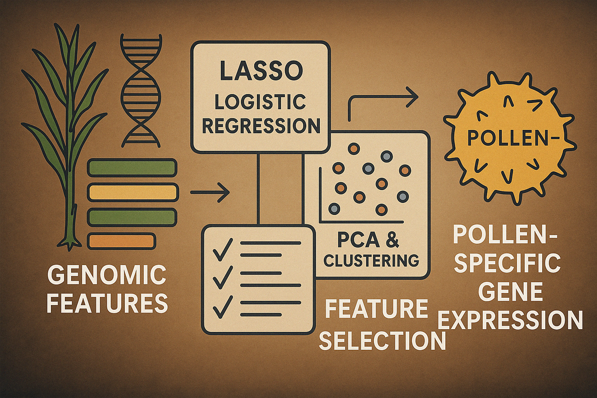

# Predicting Gene Expression Specificity in Maize Pollen

## Introduction

This project focuses on identifying pollen-specific gene expression in maize using genomic features and high-dimensional data techniques. By applying LASSO logistic regression and dimensionality reduction, we aim to build an interpretable and efficient classifier for gene specificity.

📄 **Read the full report**:\
➡️ [ST592 Final Report (PDF)](https://raw.githubusercontent.com/Fowotadeseun/Portfolio/main/Content/Projects/Predicting%20Maize%20Pollen/ST592_final_project.pdf)

📊 **View the presentation slides**:\
➡️ [Pollen Prediction Slides (PDF)](https://raw.githubusercontent.com/Fowotadeseun/Portfolio/main/Content/Projects/Predicting%20Maize%20Pollen/ST592_presentation.pdf)

------------------------------------------------------------------------

## Workflow

🧬 **Feature Extraction**: Descriptors from genomic sequences.

⚙️ **Dimensionality Reduction**: PCA for pattern discovery.

📈 **Logistic Regression with LASSO**: For sparse and interpretable model fitting.

🧪 **Model Evaluation**: ROC-AUC, accuracy, and confusion matrix analysis.

------------------------------------------------------------------------

## Key Insights

-   Only a small subset of features were relevant to pollen specificity.
-   PCA and clustering revealed no natural groupings of pollen vs. non-pollen genes.
-   LASSO selected biologically meaningful descriptors with strong predictive power.

------------------------------------------------------------------------

## Applications

-   Identifying pollen-specific genes supports targeted breeding.
-   Approach can be extended to other species and expression traits.

------------------------------------------------------------------------

## Learn More

🔗 [GitHub Repo](https://github.com/Fowotadeseun/Portfolio)\
📩 [Connect on LinkedIn](https://www.linkedin.com/in/oluwaseunfowotade/)
